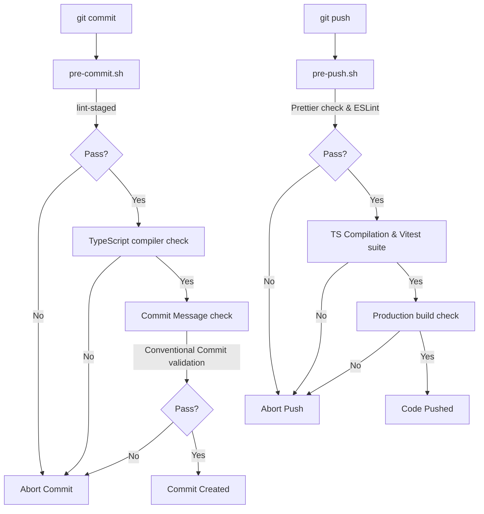

# React Frontend Starter Kit

This repository is a production-ready, type-safe React frontend starter kit built using Vite, TypeScript, Tailwind CSS (v4), and Vitest. It enforces professional styling, robust testing, structured layers, and strict quality controls.

---

## 🏗️ Architecture & End-to-End Flow

The frontend application follows a structured, **Layered Feature Architecture** that decouples user interface rendering, application state coordination, and server API calls.

```text
User Actions
    │
    ▼
┌──────────────────┐
│       Page       │ (Represents a screen/route, composes layout and modules)
└────────┬─────────┘
         │
         ▼
┌──────────────────┐
│    Components    │ (Reusable, stateless UI components, e.g. Button, Input)
└────────┬─────────┘
         │
         ▼
┌──────────────────┐
│   Hooks/Store    │ (Manages local UI states and hooks, coordinates store state)
└────────┬─────────┘
         │
         ▼
┌──────────────────┐
│  Service Client  │ (Communicates with FastAPI backend using fetch/axios)
└────────┬─────────┘
         │
         ▼
    REST API Calls (FastAPI Backend)
```

### Directory Architecture

- **`src/assets/`**: Static assets (images, SVGs, global fonts).
- **`src/components/`**: Reusable stateless or UI-only components (e.g., generic buttons, inputs, modals).
- **`src/hooks/`**: Reusable React hooks for sharing stateful UI logic (e.g. `useTheme`, `useDebounce`).
- **`src/layouts/`**: Structuring containers that manage route frames (e.g., Sidebars, main layout grids).
- **`src/pages/`**: Full screens mounted to specific routing pathways. Page components orchestrate UI modules and bind local UI states.
- **`src/services/`**: Communication layer. Houses service classes (e.g. `api.service.ts`) that handle standard fetch requests to backend endpoints.
- **`src/store/`**: Global state management configuration.
- **`src/types/`**: Centrally declared TypeScript interfaces, schemas, types, and domain-wide enums.

---

## 🤖 The Role of `docs/` in AI-Assisted Development

A distinguishing feature of this starter kit is the contents of the `docs/` folder. This documentation is strategically designed to serve as a **contextual anchor for AI Coding Assistants** (e.g., Gemini, Cursor, GitHub Copilot).

Ingesting these design documents allows AI engines to immediately grasp:

1. **Directory constraints**: Preventing the AI from generating layout files in component directories.
2. **Naming guidelines**: Ensuring class files use PascalCase and hook files use camelCase with a `use` prefix on the first attempt.
3. **Testing standards**: Ensuring generated tests use Vitest syntax and follow the behavioral testing strategy.

### Crucial Docs for AI Bootstrapping

- [testing-strategy.md](file:///o:/Random_Rant/Repo-Setup-React-FastAPI/frontend/docs/testing/testing-strategy.md): Outlines exactly how to mock APIs, arrange Vitest/RTL tests, and structure assertions.
- [git-workflow.md](file:///o:/Random_Rant/Repo-Setup-React-FastAPI/frontend/docs/development/git-workflow.md): Explains commit specifications and quality checks.
- [coding-standards.md](file:///o:/Random_Rant/Repo-Setup-React-FastAPI/frontend/docs/development/coding-standards.md): Details naming standards, folder layout rules, and standard code styling.

---

## ⚙️ Development Quality Gates (Git Hooks)

This repository uses **Husky** and custom **Git Hook Shell Scripts** to manage quality assurance. Git hooks prevent styling mistakes, syntax errors, or failing tests from being pushed to remote branches.



### Hook Pipeline Details

1. **Pre-Commit Hook (`pre-commit`)**:
   - **Lint Staged**: Runs `eslint --fix` and `prettier --write` only on the modified files currently staged for commit. This keeps commit times near instantaneous.
   - **Type Check**: Compiles the entire codebase (`tsc --noEmit`) to verify that local file changes did not break type safety elsewhere in the project.
2. **Pre-Push Hook (`pre-push`)**:
   - **Format Check**: Validates formatting rules across all codebase files.
   - **ESLint**: Strictly checks for code styling violations across the entire workspace (zero warnings allowed).
   - **Type Check**: Verifies type safety across all configurations.
   - **Unit Tests**: Runs Vitest suite once (`pnpm test:run`) to ensure zero broken test assertions.
   - **Production Build**: Compiles the project (`pnpm build`) to verify release bundle packaging has no compiling bugs.
3. **Commit Message Hook (`commit-msg`)**:
   - Uses `@commitlint` to validate the commit message format against **Conventional Commits** (e.g. `feat(auth): add login page`, `fix(api): fix fetch mapping`).

---

## 🚀 Getting Started

### Prerequisites

- Node.js (LTS version recommended)
- **pnpm** package manager (v10.x or later recommended)

> [!IMPORTANT]
> The use of **pnpm** is mandatory for this project. The Git hook quality gates (Husky pre-commit/pre-push scripts and commitlint message validations) are configured specifically to run using `pnpm` syntax. Sticking to `pnpm` also ensures lockfile integrity via `pnpm-lock.yaml`.

### Installation & Git Hooks Setup

1. **Install dependencies**:

   ```bash
   pnpm install
   ```

   During package installation, the `prepare` lifecycle hook runs automatically to register the Husky hook files in your local standalone Git configuration.

2. **Verify Git Hooks Registration**:
   Ensure that the folder `.git/hooks/` contains the hook redirection wrappers and that the `.husky/` directory contains active hook scripts.

### Available Scripts

- **Run Dev Server**:

  ```bash
  pnpm dev
  ```

  Launches the app locally at `http://localhost:5173`.

- **Run Pre-Commit Checks Manually**:

  ```bash
  pnpm quality:staged
  ```

- **Run Pre-Push Checks Manually**:

  ```bash
  pnpm quality
  ```

- **Run Unit Tests**:

  ```bash
  pnpm test
  ```

  Launches Vitest in interactive watch mode. Run `pnpm test:run` to execute tests once.

- **Build Production Bundle**:
  ```bash
  pnpm build
  ```
